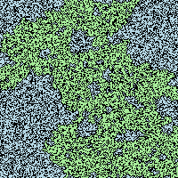

# Percolation threshold estimation with Monte Carlo

Simulating percolation using Monte Carlo simulation.

200 x 200 percolated lattice: open sites are in blue, percolated cluster in
green, and closed sites in black.

  

